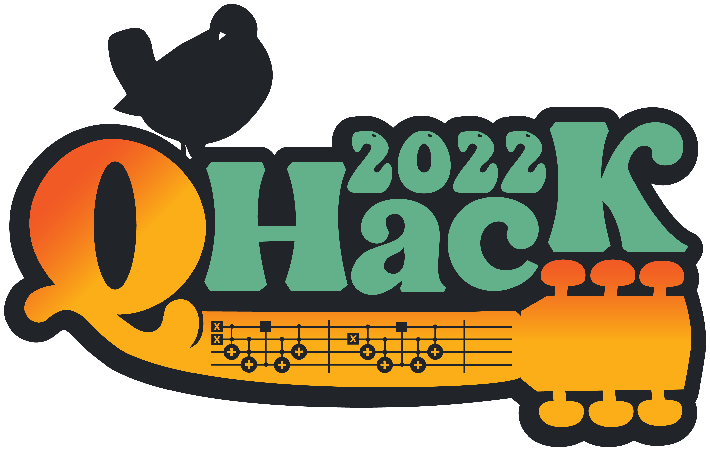

# Optimizing Quantum Graph Neural Networks for the Particle Tracking Problem 

for [QHack 2022](https://github.com/XanaduAI/QHack)

## Team: 
_The Superpositioned States of America_
* Amir Ebrahimi / [@amirebrahimi](https://github.com/amirebrahimi)
* Henry Makhanov / [@edenian](https://github.com/edenian)
* Pavan Jayasinha / [@Sinestro38](https://github.com/Sinestro38)
* Yi-Hua Lai / [@pauline610697](https://github.com/pauline610697)

## Final Deliverables

1. Fork of [QtrkX](https://github.com/amirebrahimi/qtrkx-gnn-tracking/) with experiments (see various branches)
1. [Final report](CERN_Project_Report.pdf)
1. [PR]() back to QtrkX

Related: [Final submission on QHack](https://github.com/XanaduAI/QHack/issues/141)

## Abstract

The CERN Quantum Technology Initiative declared [five quantum computing and algorithms projects](https://quantum.cern/quantum-computing-and-algorithms) of interest to the HEP community. One of these projects is [particle tracking reconstruction](https://quantum.cern/quantum-graph-neural-networks). Particle tracking reconstruction is a fundamental research aspect for particle collider experiments, which aim to validate the elementary particle theories through the observation of particle trajectories after collisions. With the upgrade of the Large Hadron Collider (LHC) to High Luminosity (HL-LHC) at CERN in the near future (circa 2027), the rate of collisions will be further ramped up, yielding many more detector hits and a larger scale of data. Therefore, being able to efficiently identify the particle trajectories from data of a large scale and increased complexity may be the key to unveil the nature of particle physics. With the development of quantum computers on its own growth curve, untangling the information from big data via quantum computing appears to be a promising solution. Our work focused on improving the existing state-of-the-art of Quantum Graph Neural Networks (QGNNs) to solve the particle tracking reconstruction problem. Specifically, we have have resolved the vanishing/exploding gradient problem during early stages of training, introduced new ansätze for the parameterized quantum circuits (PQCs) used in the Edge/Node networks, and tested these new ansätze on a modified dataset after pre-processing. After experimenting with a variety of different circuit architectures, we have constructed two high performing circuit ansätze: "qc102_pqc (Van Buren)" and "qc103_pqc (Coolidge)". Both circuits, coupled together with an improved QGNN outperform the "qc10_pqc" ansätze used by CERN in the original experiment on a smaller dataset.

## Project Files

Most of the files related to the project are located at a fork of [QtrkX](https://github.com/amirebrahimi/qtrkx-gnn-tracking/) (look at the various branches). The files in this repository are supporting notebooks and python scripts that were used for the main project as well as the final report.